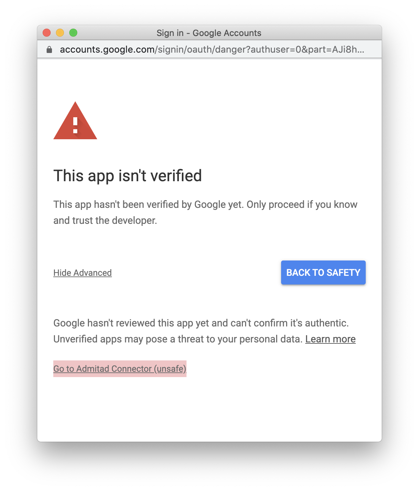

# Free Google Data Studio Connector for Admitad
 
[](https://app.fossa.com/projects/git%2Bgithub.com%2Fcawa-93%2Fadmitad-data-studio-connector?ref=badge_shield)

*This is not an official Google or Admitad product!*

**The project sponsored from [patreon]**.


This [Google Data Studio](https://datastudio.google.com) [Community
Connector](https://developers.google.com/datastudio/connector) lets users query
the [Admitad](https://admitad.com/) advertiser reports.

## Getting started

### Add Admitad Data Source

Using the Admitad Connector is simple! Just visit **[this link](https://datastudio.google.com/datasources/create?connectorId=AKfycbw4iHjwZXZ7gXL38I3fBgvdwcPcf7l2NwTMPGcEtVcQwMQf9MXKt21yBBWbfC8vKKQXnQ)** to create a new Data Source.

#### An alternative way
1. Visit [Data Studio](https://datastudio.google.com/) and click on **Data Sources** from the left-hand navigation.
1. Click on the + (Add) button in the bottom right corner to create a new Data Source.
1. Choose Partner Connectors and find `Build Your Own`
1. Set `Deployment ID`
    ```
    AKfycbw4iHjwZXZ7gXL38I3fBgvdwcPcf7l2NwTMPGcEtVcQwMQf9MXKt21yBBWbfC8vKKQXnQ
    ```
1. Click `Validate` and choose `Admitad connector` bellow.

### Authorization
At the first authorization you can receive a warning "This app isn't verified". This is normal.

In this window, click **"Advanced"** and then **"Go to Admitad Connector (unsafe)"** to continue authorization. You can always revoke access in the same manner as for [any connector](https://support.google.com/datastudio/answer/9053467).



## Supported Advertiser reports

- ✅ Reports on date
- ✅ Reports on publishers
- 🚧 Reports by actions *(in progress)*
- 🚧 Reports by ad spaces *(in progress)*
- 🚧 Reports on banners *(in progress)*
- 🚧 Reports on landing pages *(in progress)*
- 🚧 Reports on landing pages and ad spaces *(in progress)*
- 🚧 Reports on channels *(in progress)*
- 🚧 Reports on groups *(in progress)*
- 🚧 Reports by offline orders *(in progress)*


To speed up development, you can [sponsor][patreon] or **STAR** this repository to help promote it.


[patreon]: https://www.patreon.com/Kozack


## License
[](https://app.fossa.com/projects/git%2Bgithub.com%2Fcawa-93%2Fadmitad-data-studio-connector?ref=badge_large)